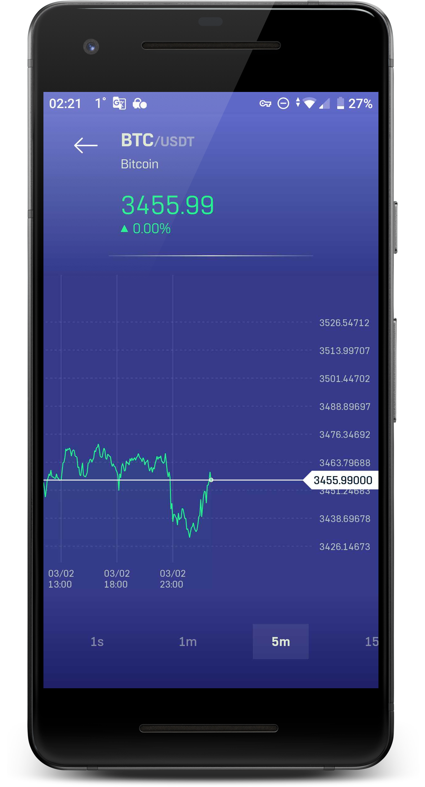
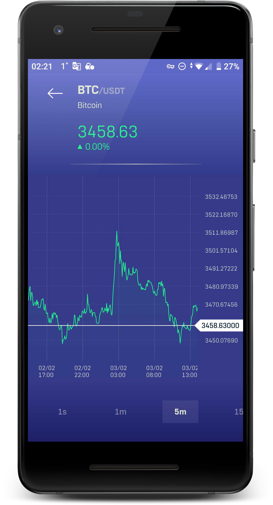
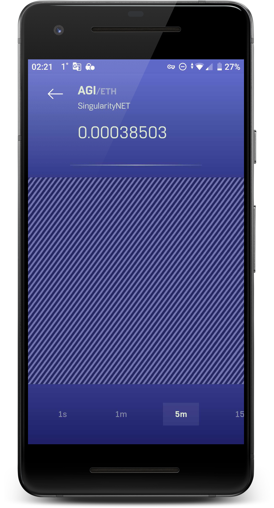

# :construction: Work in progress :construction: Charts-n-Rates 2.0 :construction:

### Module: androidcmpapp
New version of same app using jetpack compose, kmm, ktor and dew other libs
interim app update:
Splash and QuoteAsset screens rewritten using Jetpack Compose (data modules rewritten using kmp and ktor)
Chart screen still uses previous stack (gdxlib for chart data and rxjava-based data modules)

still row codebase and partially tested

**[Install last version 2.0.1 on Google Play](https://play.google.com/store/apps/details?id=com.msgkatz.ratesapp)**

# Charts-n-Rates 1.0 (android)

### Module: android
*App for cryptocurrency charts and rates based on Binance exchange data*


Chart-n-Rates is a showcase of android application, that uses realtime data to build stock charts and infolists.<br/> 
It pulls data in from [Binance Exchange](https://www.binance.com/en), using both REST and Web Socket [APIs](https://github.com/binance-exchange/binance-official-api-docs) of Binance platform.<br/> 
It demonstrates the use of [libGDX](https://github.com/libgdx/libgdx) to create realtime charts with the help of OpenGL 2D-graphics.<br/>
App demonstrates also the use of [material principles](https://www.google.com/design/spec/material-design/introduction.html#introduction-principles) to create simple and understandable UIs.


**[Install on Google Play](https://play.google.com/store/apps/details?id=com.msgkatz.ratesapp)**


### Screenshots







### License

```
 Copyright 2025 msgkatz

 Licensed under the Apache License, Version 2.0 (the "License");
 you may not use this file except in compliance with the License.
 You may obtain a copy of the License at

     http://www.apache.org/licenses/LICENSE-2.0

 Unless required by applicable law or agreed to in writing, software
 distributed under the License is distributed on an "AS IS" BASIS,
 WITHOUT WARRANTIES OR CONDITIONS OF ANY KIND, either express or implied.
 See the License for the specific language governing permissions and
 limitations under the License.
```
